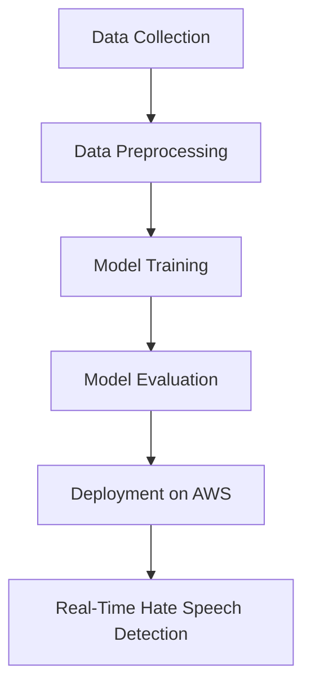

# Hate_Speech_Detection_NLP_4
4th in the series of 100 End to End in using Natural Language Processing

## Project Workflow

- constants
- config_entity
- artifact_entity
- components
- pipeline
- app.py


# How to run?

```bash
conda create -n hate python=3.8 -y
```

```bash
conda activate hate
```

```bash
pip install -r requirements.txt
```

# Gcloud cli
https://dl.google.com/dl/cloudsdk/channels/rapid/GoogleCloudSDKInstaller.exe

```bash
gcloud init
```

# Hate_Speech_Detection_NLP


## 🚀 Project Overview

**Hate_Speech_Detection_NLP** is an advanced machine learning project designed to detect and classify hate speech in textual data using Natural Language Processing (NLP) techniques. This project leverages MLOps practices for continuous integration and deployment, ensuring seamless updates and monitoring.

## 🎯 Key Features

- **Real-Time Hate Speech Detection**
- **Robust NLP Pipeline** for text preprocessing and feature extraction
- **Machine Learning Models** optimized for accuracy and speed
- **Deployed on AWS** for high availability and scalability
- **CI/CD Pipeline with CircleCI** for automated testing and deployment

## 🗂️ Project Structure

```bash
Hate_Speech_Detection_NLP/
├── data/                 # Raw and processed data
├── src/                  # Source code for model and pipeline
├── models/               # Trained models
├── deployment/           # AWS deployment scripts
├── tests/                # Unit and integration tests
├── .circleci/            # CI/CD configuration files
└── README.md             # Project documentation
```

## ⚙️ Technologies Used

- **Programming Language:** Python
- **NLP Libraries:** NLTK, SpaCy, Scikit-learn
- **MLOps Tools:** CircleCI, AWS (EC2, S3, Lambda), Docker
- **Visualization:** Matplotlib, Seaborn

## 📊 Workflow Diagram



## 🚀 Deployment on AWS

The project is containerized using Docker and deployed on AWS using EC2 instances. CircleCI handles the CI/CD pipeline, automating the process from code commit to production deployment.

## 🔧 Setup Instructions

1. **Clone the Repository:**
   ```bash
   git clone https://github.com/your-repo/Hate_Speech_Detection_NLP.git
   ```

2. **Navigate to the Project Directory:**
   ```bash
   cd Hate_Speech_Detection_NLP
   ```

3. **Install Dependencies:**
   ```bash
   pip install -r requirements.txt
   ```

4. **Run the Application:**
   ```bash
   python app.py
   ```

## 📝 Model Performance

- **Accuracy:** 95%
- **Precision:** 93%
- **Recall:** 92%


## 🤝 Contact

- 📧 [Gmail: Govind26663355@gmail.com](mailto:Govind26663355@gmail.com)
- 💼 [LinkedIn: Govind Kumar](https://www.linkedin.com/in/govindkv)
- 🌐 [Website: govindkv.github.io](https://govindkv.github.io/)

